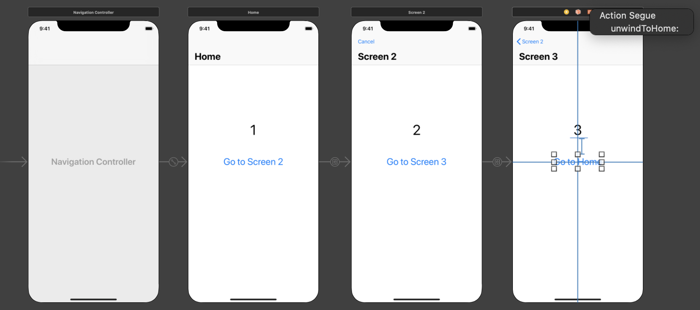
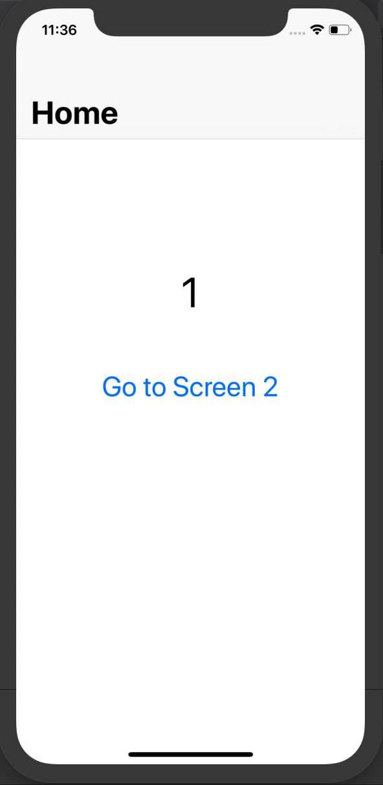

# Simple Unwind Example
When use storyboards, it’s good to be consistent and use the same mechanism to go forward and backward. Unwind segues are the counterpart of action segues.

The point of storyboards and segues in iOS apps is to remove navigation code from view controllers. So, if you use segues to go forward, you should also use segues to move backward.

## Storyboard screen view

## Demo

